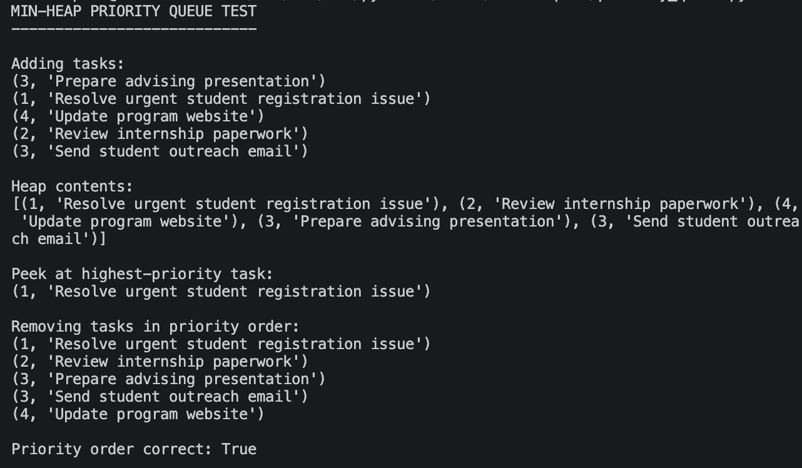
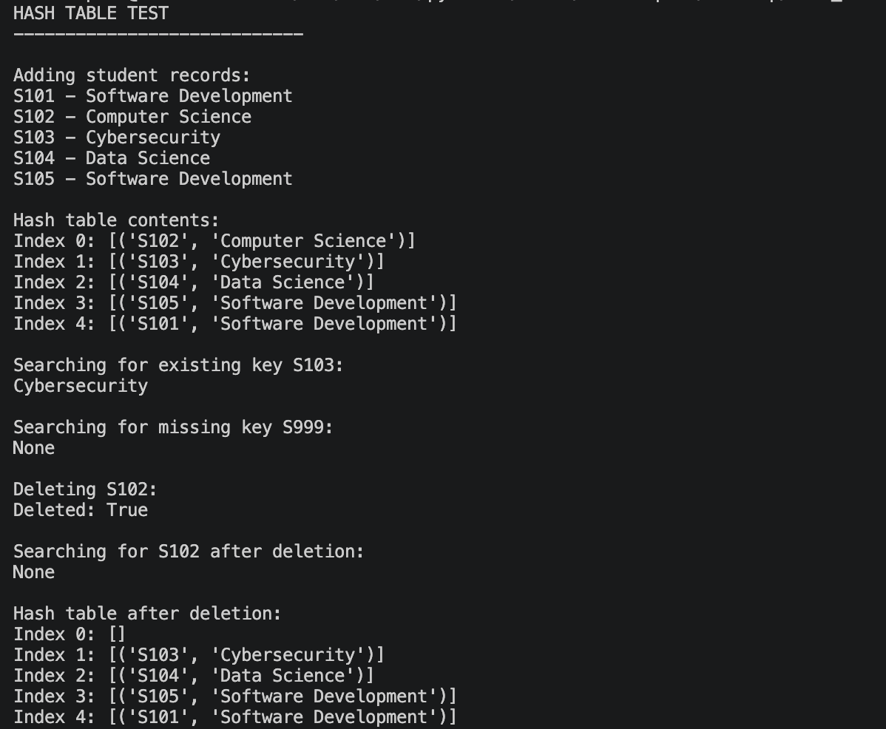
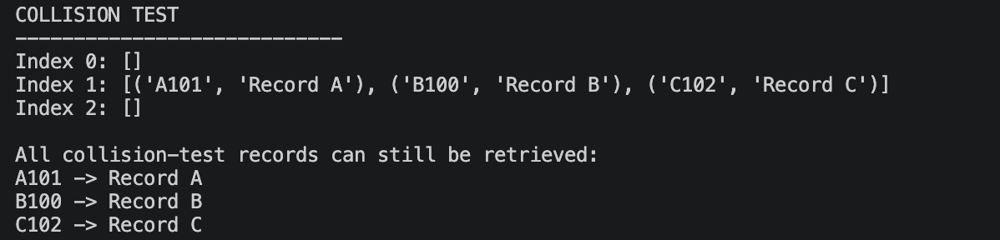
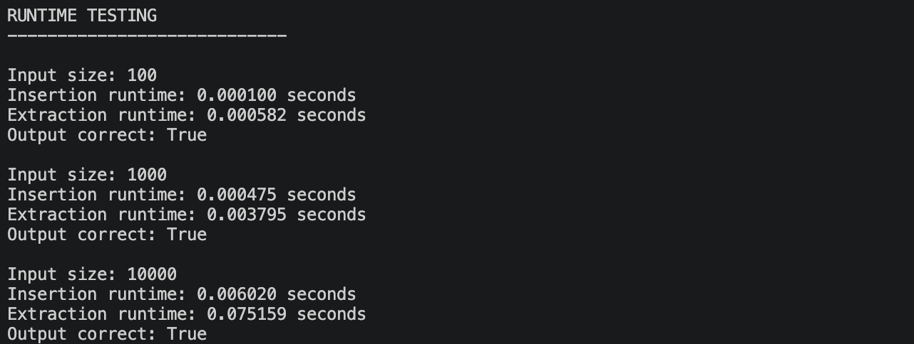
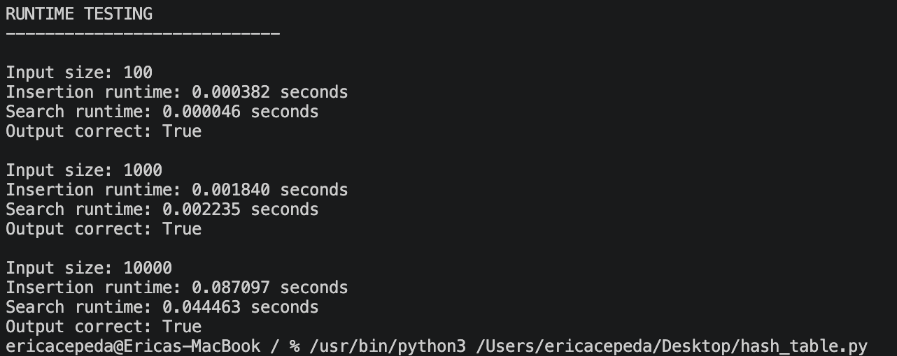

# Programming Assignment 3 Report: Heaps, Priority Queues, and Hashing

**Name:** Erica Cepeda

## 1. Explanation of Heap-Based Priority Queues

I implemented a **min-heap priority queue** in this assignment. In a min-heap, the element with the lowest priority is kept at the root of the heap. In my implementation, small numbers represent high-priority tasks. For example, a task with priority 1 has to be processed before the task with priority 3.

The heap is represented as a Python list. When a new element is added, it is initially appended to the end of the list. Then, **heapify-up** operation is performed. During this process, the newly added element is compared with its parent. If the new element is less than its parent, elements swap places. This operation is performed until the heap property is restored.

For extraction, the minimum element is removed from the root. The last element in the heap is moved into the root of the heap and **heapify-down** operation is performed. The new root element is compared with its children and swapped with the smaller one, if necessary.

Heap-based priority queues are effective, because the maximum-priority element is stored at the root of the heap, while no need exists to sort the whole collection after each operation.

### Priority Queue Test Evidence

## 2. Runtime Analysis of Priority Queue Operations

The expected runtime of the main min-heap priority queue operations is:

| Operation | Expected Runtime |
|---|---|
| Insert | O(log n) |
| Peek | O(1) |
| Extract Minimum | O(log n) |

The **insert** operation has the expected runtime of **O(log n)**, because a newly inserted element may move up to the root of the tree. The tree has the logarithmic height, so the number of comparisons and swaps will grow logarithmically with the number of elements.

The **peek** operation takes **O(1)** time, because the minimum element is always located at the root of the heap, which corresponds to index 0 of the Python list.

The **extract minimum** operation takes **O(log n)** time. After the element with the minimal priority is extracted, the last element moves into the root of the heap and may have to move down the tree levels.

Even though a single insertion or extraction takes O(log n) time, insertion or extraction of the whole collection of n elements takes approximately **O(n log n)** time.

## 3. Explanation of Hash Tables

For the second part of the assignment, I implemented a basic **hash table** using a Python list of buckets that store multiple key-value pairs.

The hash function in my hash table computes the sum of the numerical values of the characters of the key after it is converted into a string. Each character is converted to a number with Python `ord()` function and then the sum is taken modulo with the table size. This determines the position at which the key-value pair has to be stored.

The hash table uses **separate chaining** as the collision handling mechanism. With chaining, each index in the table corresponds to a list. If two keys give the same index in the table, both keys and their values are stored in the same bucket.

For insertion, the program computes the index and inserts the key-value pair in the proper bucket. If the key already exists, its value gets updated.

For search, the program computes the index and searches for the key-value pair in the proper bucket. If the key is found, its value is returned. Otherwise, `None` is returned.

For deletion, the program finds the appropriate bucket, finds the key, and deletes the key-value pair. The function returns `True` if a key is found and deleted. Otherwise, it returns `False`.

The collision test shows how separate chaining works. Several records can be placed into the same bucket even though all the records can be accessed correctly.

### Hash Table Test Evidence

### Hash Table Collision Evidence

## 4. Runtime Analysis of Hash Table Operations

The expected average-case and worst-case runtimes for the hash table are:

| Operation | Average Case | Worst Case |
|---|---|---|
| Insert | O(1) | O(n) |
| Search | O(1) | O(n) |
| Delete | O(1) | O(n) |

In the average case, the hash function distributes the keys across the buckets, so insertion, search, and deletion operations take approximately **O(1)** time.

The worst-case runtime may be **O(n)** if there are too many colliding keys and they are stored in the same bucket. In this situation, the program has to search through the long chain of key-value pairs.

The **load factor** of a hash table also influences its performance. Load factor is the ratio of the number of stored elements and the total number of slots. The higher the load factor is, the more collisions are likely to happen. This increases the lengths of the chains and the time of insertion, deletion, and search operations.

To decrease the number of collisions during runtime testing, the size of the hash table was increased depending on the number of input elements.

## 5. Runtime Testing Results

Runtime testing was performed with input sizes of **100, 1,000, and 10,000** as suggested in the assignment. For the priority queue, insertion and extraction operations were tested and for the hash table insertion and search were tested. The report is supposed to include the following information about the tests: input size, operation, runtime and correctness of the output. :contentReference[oaicite:1]{index=1}

### Priority Queue Runtime Results

| Input Size | Operation | Runtime | Correct |
|---|---|---:|---|
| 100 | Insert | 0.000044 seconds | True |
| 100 | Extract All | 0.000205 seconds | True |
| 1,000 | Insert | 0.000476 seconds | True |
| 1,000 | Extract All | 0.003247 seconds | True |
| 10,000 | Insert | 0.005682 seconds | True |
| 10,000 | Extract All | 0.133236 seconds | True |

As can be seen, the execution time increases as the number of elements increases. Insertion is a fast process and extracting all items takes longer, because extract all consists of multiple extraction processes. It is consistent with the logarithmic runtimes of individual heap insertion and extraction operations.

### Priority Queue Runtime Evidence

### Hash Table Runtime Results

| Input Size | Operation | Runtime | Correct |
|---|---|---:|---|
| 100 | Insert | 0.000055 seconds | True |
| 100 | Search | 0.000045 seconds | True |
| 1,000 | Insert | 0.001154 seconds | True |
| 1,000 | Search | 0.000780 seconds | True |
| 10,000 | Insert | 0.085783 seconds | True |
| 10,000 | Search | 0.060464 seconds | True |

The hash table passed all the tests successfully. The runtime increases with the growth of the number of elements, but still demonstrates efficiency of the insertion and retrieval. The exact runtime can vary between program executions due to the computer workload and processor scheduling. Overall, the results support the expected efficiency of hash tables if the keys are well distributed across the buckets.

### Hash Table Runtime Evidence

## 6. Reflection

This assignment showed me that choice of the data structure depends on the operations that are needed to be performed efficiently. I understood that heaps and hash tables are designed for different operations before implementing them, but now I understand the difference between them better. I saw how the min-heap works and how the priority queue keeps the most important element accessible without sorting the whole collection. I realized that insertion and extraction take more time than simply peeking at the root.

Hash table is efficient in terms of retrieving data, not keeping the order. The collision test was helpful, because I saw that the collision handling strategy is essential. Several keys can map to the same position, but separate chaining can help keep them accessible. Overall, this assignment taught me that efficient computation is not just about writing the fast code.
